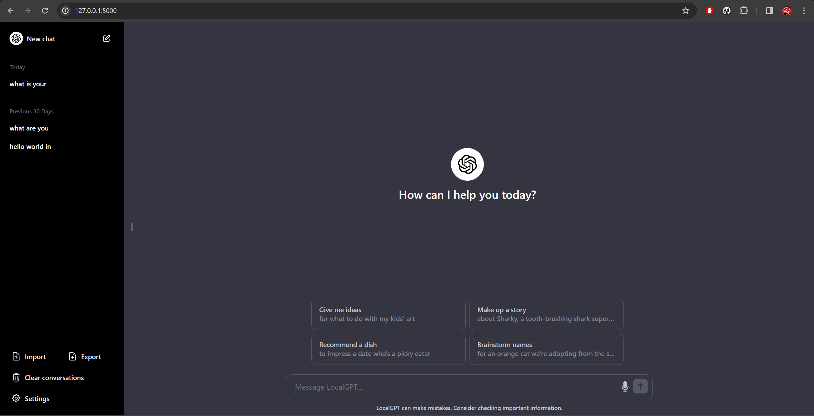
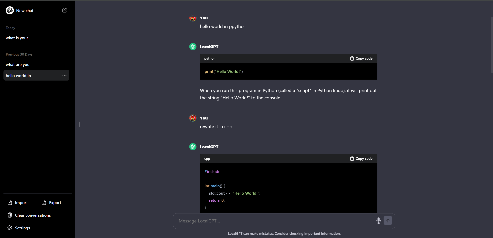

# localGPT
clone of chatgpt usign html css js and flask

## Setup LLM

- Install [LM Studio](https://lmstudio.ai/) or and other openai API compatible server
- Load and run a large language model to localhost
- you can see the setup on [youtube](https://www.youtube.com/watch?v=IgcBuXFE6QE&ab_channel=AllAboutAI)

